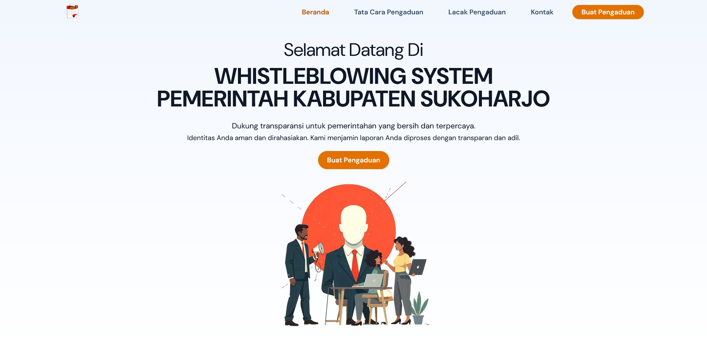
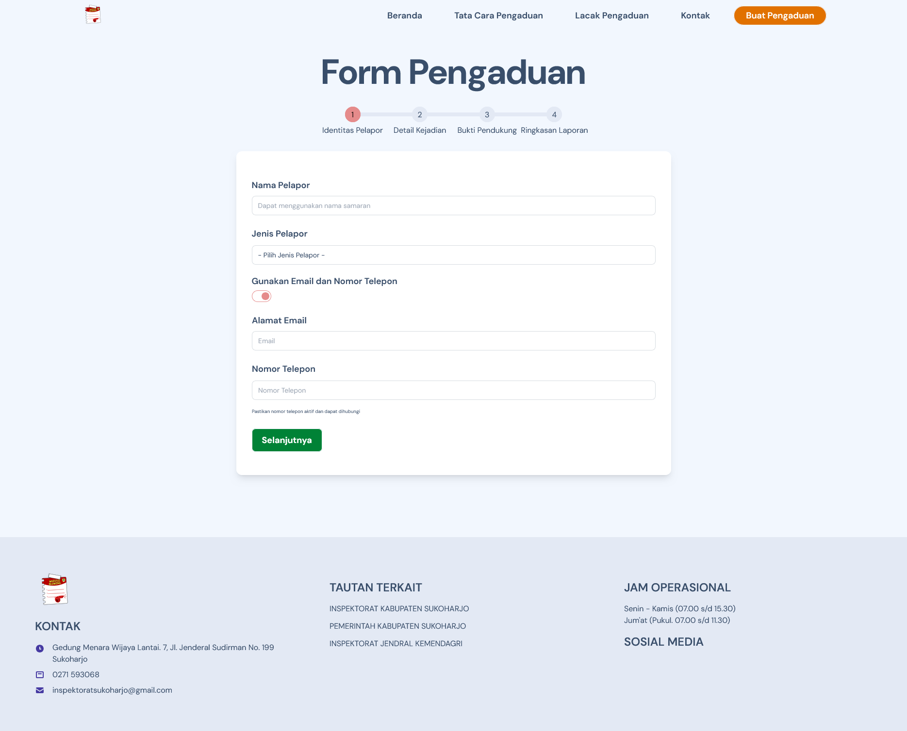
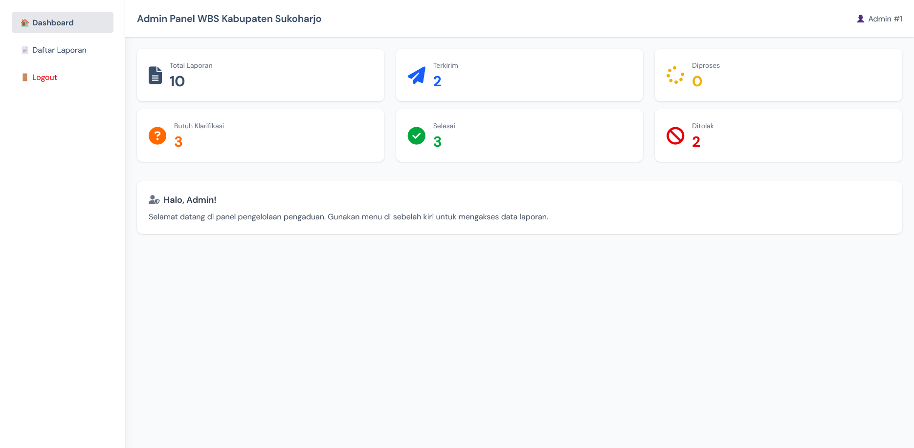
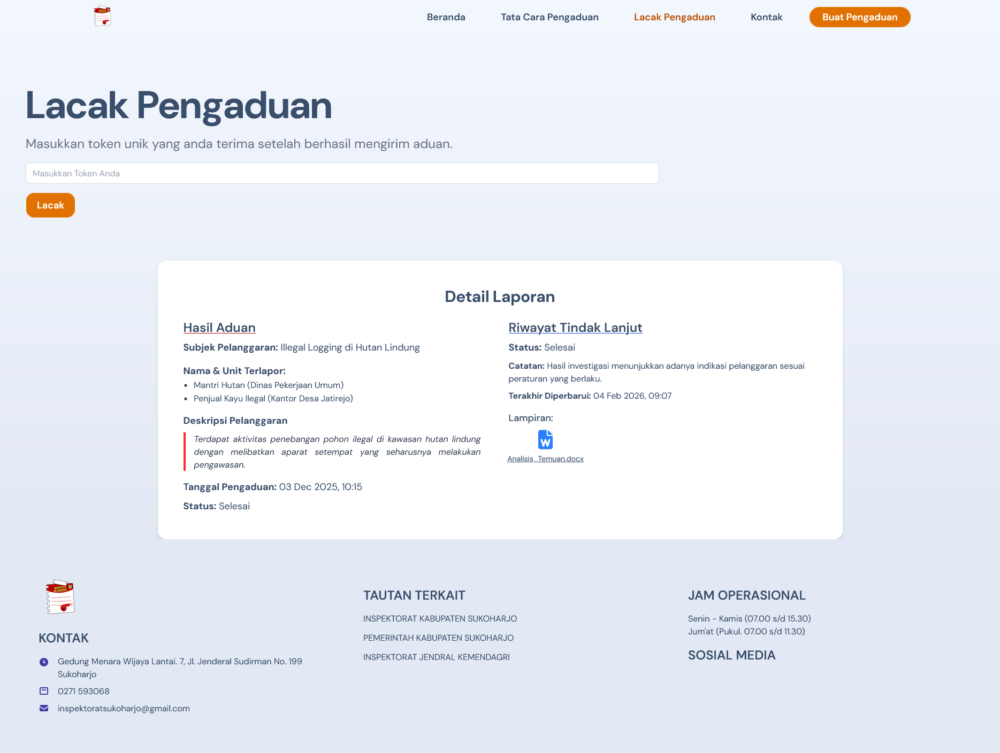

# Whistleblowing System (WBS) - Sukoharjo Regency

[](README.id.md) [](README.md)

> **[🇮🇩 Baca Versi Bahasa Indonesia di sini](README.id.md)**

A reporting system designed to ensure transparency and reporter security.

**Project Context:**
This project is a **re-development of a system originally created during an internship program**. The primary focus of this iteration is the infrastructure migration from **MySQL to PostgreSQL** and upgrading the framework to **Laravel 12** to enhance performance and data integrity.

---

## ⚠️ Development Notes & Known Limitations

As an active portfolio project currently under development, please note the following technical conditions:

1.  **Desktop-First UI:**
    * The User Interface (UI) is currently optimized for **Desktop/Laptop** screens.
    * Mobile responsiveness (smartphones/tablets) is still in progress and may require further CSS adjustments.

2.  **Database Migration Status:**
    * This project was recently migrated from **MySQL to PostgreSQL** (Strict Mode).
    * Some status slugs in the database still use Indonesian terms (e.g., `diproses`, `selesai`) to maintain compatibility with legacy data, while the codebase uses English variable naming. This will be standardized in version 2 (v2).

3.  **Notification Features:**
    * The WhatsApp notification feature (via WablasService) is currently **disabled/commented out** in the controller and has been fully replaced by Email Notifications (SMTP).

---

## 🚀 Key Features

### 🔒 For Reporters (Public)
* **Guaranteed Anonymity:** Reporters are not required to disclose personal identity.
* **Tracking System:** Uses a **Unique 6-Character Token** (e.g., `A1B2C3`) to track report status without logging in.
* **Secure Evidence:** Supports file attachments (Images, PDF, DOCX) securely stored in `storage/private`.
* **Email Notifications:** Automatic status updates sent to the reporter's email (if provided).

### 🛡️ For Admins
* **Statistical Dashboard:** Visual summary of reports based on categories and status.
* **Report Management:** Update report status (In Review, Needs Clarification, Resolved).
* **Follow-up System:** Add internal notes and upload follow-up evidence.
* **Strict Validation:** Server-side validation to prevent spam or incomplete data submission.

---

## 📸 Application Preview

| Landing Page | Reporting Form |
| :---: | :---: |
|  |  |


| Admin Dashboard | Tracking System |
| :---: | :---: |
|  |  |


---

## 🛠️ Tech Stack

* **Backend:** Laravel 12.x
* **Database:** PostgreSQL (Strict Mode)
* **Frontend:** Blade Templates + Tailwind CSS
* **Security:** CSRF Protection, Encrypted Sessions, Secure File Storage

---

## 📥 Installation Guide (Local Development)

Follow these steps to run the project locally:

### 1. Prerequisites
Ensure you have the following installed:
* PHP >= 8.2
* Composer
* PostgreSQL
* Node.js & NPM

### 2. Clone & Install
```bash
# Clone repository
git clone [https://github.com/your-username/wbs-sukoharjo-v1.git](https://github.com/your-username/wbs-sukoharjo-v1.git)
cd wbs-sukoharjo-v1

# Install PHP & JS dependencies
composer install
npm install
```

### 3. Environment Configuration
Copy .env.example to .env and configure your PostgreSQL connection:
```bash
cp .env.example .env
```
Edit .env
```ini,toml
DB_CONNECTION=pgsql
DB_HOST=127.0.0.1
DB_PORT=5432
DB_DATABASE=wbs_sukoharjo
DB_USERNAME=postgres
DB_PASSWORD=your_password
```

### 4. Database Setup
Generate app key, link storage and run migration/seeders (essential for initial data):
```bash
php artisan key:generate
php artisan storage:link
php artisan migrate:fresh --seed
```

### 5. Run Application
Open two separate terminals to run the Laravel server and build frontend assets
```bash
# Terminal 1
npm run dev

# Terminal 2
php artisan serve
```

---

## 🔑 Demo Account (Default)
If you ran the --seed command, use the following credentials to access the Admin Panel:
* **URL:** /admin
* **Username | Password :** admin | admin

---

## 👨‍💻 Author
Developed by **Mieke** as part of a Full-Stack Web Development portfolio.